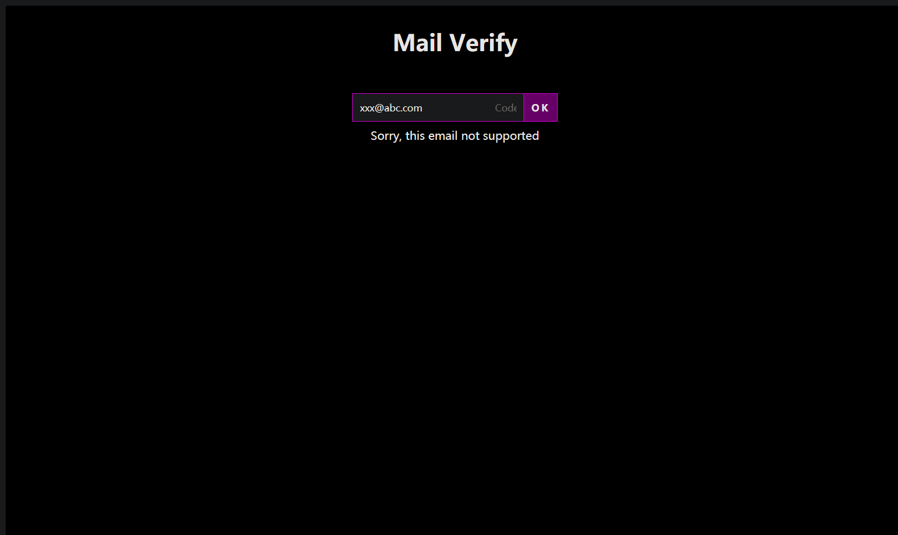

# [Golang portier](https://github.com/vlorc/portier)
[英文](README.md)

[](https://opensource.org/licenses/Apache-2.0)
[](https://codebeat.co/projects/github-com-vlorc-portier-master)
[](https://goreportcard.com/report/github.com/vlorc/portier)
[](https://travis-ci.org/vlorc/portier?branch=master)
[](https://coveralls.io/github/vlorc/portier?branch=master)

Nginx cas! 200+ 行实现的小巧邮箱认证服务



## 安装
	go install github.com/vlorc/portier@latest

## 使用

+ portier

```shell
./portier -lang cn                         \
  -cookie.domain .example.com              \
  -mail.addr smtp.exmail.qq.com:465        \ 
  -mail.user xxxx                          \ 
  -mail.pass xxxx
```

+ app

```shell
python -m http.server -b 127.0.0.1 8080
```

+ nginx

```shell
nginx -c example/nginx.conf
```

# 关键字

**nginx cas, mail verify, auth_request, portier**